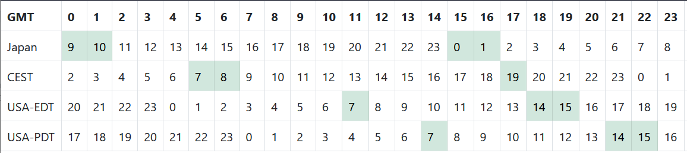
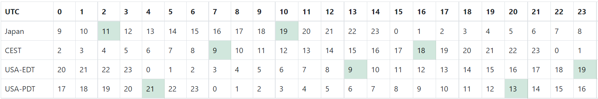

# Board Game Scheduler

Do you play board games with friends online?
Are you tired of waiting for your friend to finish work and play his turn?
Now with Board Game Scheduler you can optimize the turn order for the least amount of waiting!
Find the optimal turn order for playing board games with friends on different schedules.
Use the tool online at [Github pages](https://stcase.github.io/board-game-scheduler/), or read below for more details.

## Development

This project was done in React.js, as part of my attempt to learn react.
So there is plenty of room for improvement.
If you want, feel free to give tips on how to make it better.
Things I want to add to include using JSDoc, unit tests, and typing.

### Develop

To run in development mode:

```
npm start
```

### Deploy

This can be deployed to github pages with the command

```
npm run deploy
```

Make sure to verify that `homepage` in `package.json` is correct.

## Theory and Design

In the image below, we can see that if the turn order runs top to bottom, each player can play twice per day,
but if it runs bottom to top each player can play less than once per day. So how do we algorithmically find the optimal turn order?



The core of this app lies in `components/calculateOptimal.jsx`.
We can imagine each square as the vertex of a weighted graph, with a few variations.
The edge weights between vertices represent the time in hours between turns.
The graph has the following rules:

- A green--or available--square points to the square below it with an edge weight of 0.
- A unavailable square points to the square to the right of it with an edge weight of one.
- When an edge points beyond the bottom or right of the grid, it wraps back to the top or left.
- From the above, each vertex can only point to one other vertex, but each vertex can have bewteen zero and two vertices pointing to it.
- All vertices are adjacent to their connecting vertices.

From those rules, the weighted path length (sum of the edge weights) between two (available) vertices represents the total time in hours between turns.
The goal then is to maximize the number of turns (or edges with weight 0) per hour (edges with weight one).
Unfortunately this doesn't fall into the common minimum path problem, because the optimization is a ratio of both the path and the vertices in the path.

Because each vertex only points to one other vertex, it creates some key feature for solving this algorithmically:

- Multiple closed and separate cycles (of the same length) can exist in one graph.
- However, any closed cycle is equal to the optimal solution for the graph.

The first point is simple: you can have two possibilities of timing as long as they have the same path length.
For example, in the image below there are two cycles, starting at 11 and 19 in Japan.
The second is key to solving the problem: any closed cycle is an optimal cycle.
If there was a more and less frequence cycle in the same graph, the more frequent would intercept with the less frequent (because all vertices are adjacent to their connecting vertices), and thus the less frequent one would become part of the more frequent one.



The solution is then to traverse the map until a cycle is found, because any cycle is an optimal cycle.
Once a cycle is found, recurse back to the meeting point and subtract the edge weights (hours) and turns to get the amount of hours and turns in the cycle.
With that you can get the optimized rounds per day.

The above will need to be completed for each permutation of player order.
We always start with the first player on the schedule because turn order is what matters, not who starts.
Unfortunatley this part of the algorithm gives a run time of (n-1)!
I've put some thought into how to improve this by not recreating the map traversal each time, but haven't developed a solution yet.
